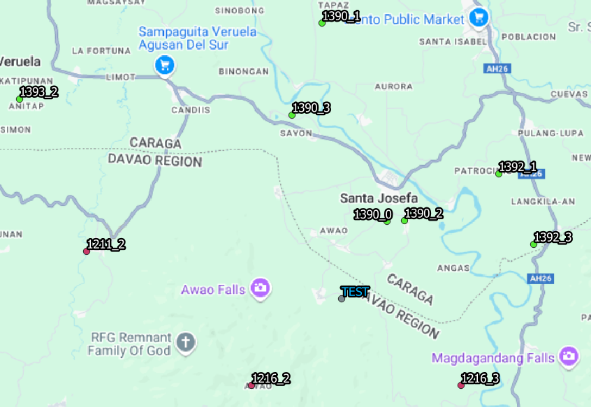

# Location Based Planning
## Introduction
Location-based planning is an algorithm using existing site data to plan location-based cell parameters, such as NR and LTE TAC.

From the map above, there are 10 neighboring sites around the test site, "TEST". The green ones have 46003 assigned as their TAC, while the red ones have 41082. The test site which is in gray and labeled in blue, has yet to be assigned a TAC. It is possible to use location based planning to assign the site one.

## Algorithm
|Site Code|TAC|N Closest|Points|
|---|---|---|---|
|1390_0|46003|1|10|
|1390_2|46003|2|9|
|1216_2|41082|3|8|
|1216_3|41082|4|7|
|1390_3|46003|5|6|
|1392_3|46003|6|5|
|1392_1|46003|7|4|
|1211_2|41082|8|3|
|1390_1|46003|9|2|
|1393_2|46003|10|1|

The table above shows which neighboring sites are closest and farthest to the test site, N Closest shows the ranking with 1 being the closest and 10 the farthest. Points are then assigned to each of the neighboring sites, which is the reverse of N Closest. Thus the closest neighboring site to the test site will have 10 points, while the farthest, 1. These points will serve as the basis for selecting the TAC. An important parameter of the algorithm is selecting the minimum number of neighboring sites to consider. Furthermore, this will also determine the highest points attainable. In this case, this was selected to be 10.

|TAC|Sum of Points|Score|
|---|---|---|
|41082|18|32.7|
|46003|37|67.3|

From the table above, points are calculated by TAC. The score is calculated by the respective points for each TAC divided by the total points multiplied by 100. The TAC with the highest score will be selected as the planned TAC, in this case, 46003. Another important parameter of the algorithm is the score threshold. If the score of the selected TAC is below this threshold then it is considered a border site. If a site is a border site, it means that the site is in between the border of several TAC's. The score threshold can be thought of as the selection confidence level. A higher value, means a stricter criteria. Furthermore, it is possible to apply this algorithm to other location-based cell parameters such as BSC, RNC, LAC, and RAC.
# loc_tool_experiment
## Input:
### All input variables can be found under main.
* RF_database.xlsx: RF Database to get site data from
* rat: RAT of the location-based cell parameter to plan
* loc_cell_param: Location-based cell parameter to plan
* prefilter_col: Column to use as a prefilter for the neighbor search algorithm. The larger the range of the column the more sites to choose from. Possible choices are:
    1. Region
    2. Province
    3. Municipality
* sample_percent: Percentage of sites to use as a test
* trials: Number of trials per experiment
* experiment_parameters.csv: Combinations of filter and threshold to simulate. Filter refers to the minimum number of neighbors to consider, while threshold is the score threshold, which were discussed above.
## Output
* experiment_result.csv: Results of the simulation. Summarizes the accuracy results per prefilter and threshold combination. The combination with the highest accuracy is the most optimal parameters for the algorithm for the RF database used.